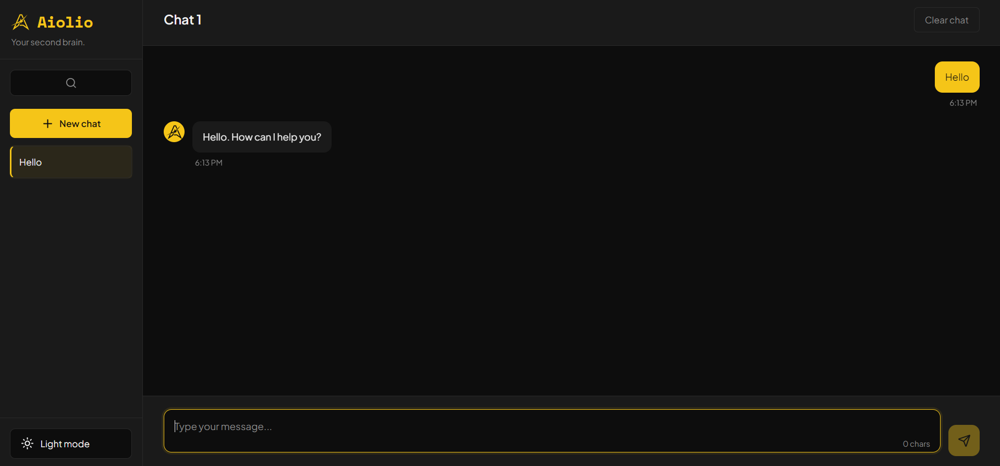

# Aiolio Chatbot

A full-stack AI chatbot web application built with React and FastAPI, powered by Groq's LLaMA 3.3 model.




---

> ⚠️ **Live demo note:** The backend is hosted on Render's free tier, which spins down after periods of inactivity. The first message after idle may take up to 50 seconds while the server wakes up — subsequent messages will be fast.

## Features

- **Multiple chat sessions** — create, switch between, and delete conversations
- **Persistent conversation history** — full context sent on every message
- **Code block rendering** — syntax-highlighted code with one-click copy
- **Dark / light theme** — smooth toggle with CSS transitions
- **Custom persona** — Aiolio responds with a distinct, concise personality
- **Responsive design** — collapsible sidebar on mobile
- **Session search** — filter conversations by keyword
- **Auto-naming** — sessions are named from the first message automatically

---

## Tech Stack

| Layer | Technology |
|---|---|
| Frontend | React, Tailwind CSS, shadcn/ui |
| Backend | Python, FastAPI |
| AI | LLaMA 3.3 70B via Groq API |
| Fonts | Plus Jakarta Sans, JetBrains Mono |

---

## Project Structure

```
Aiolio-Chatbot-app/
├── backend/
│   ├── server.py        # FastAPI app — sessions, chat, Groq integration
│   ├── requirements.txt
│   └── .env             # GROQ_API_KEY (not committed)
└── frontend/
    ├── src/
    │   ├── App.js        # Main React component
    │   └── App.css       # Styles and theme variables
    └── package.json
```

---

## Getting Started

### Prerequisites

- Python 3.10+
- Node.js 18+
- A free [Groq API key](https://console.groq.com)

### 1. Clone the repo

```bash
git clone https://github.com/HassanAiolio/aiolio-chatbot-app.git
cd aiolio-chatbot-app
```

### 2. Backend setup

```bash
cd backend
pip install -r requirements.txt
```

Create a `.env` file in the `backend` folder:

```
GROQ_API_KEY=your_api_key_here
```

Start the server:

```bash
python -m uvicorn server:app --reload --port 8000
```

The API will be running at `http://localhost:8000`.

### 3. Frontend setup

```bash
cd frontend
npm install --legacy-peer-deps


npx craco start
```

The app will open at `http://localhost:3000`.

> **Running locally?** The frontend reads the backend URL from the `REACT_APP_API_URL` environment variable. Create a `.env` file in the `frontend` folder with:
> ```
> REACT_APP_API_URL=http://localhost:8000
> ```
> Without this, API calls will fail. For production, set this variable to your deployed backend URL (e.g. on Render).

---

## API Endpoints

| Method | Endpoint | Description |
|---|---|---|
| GET | `/api/health` | Health check |
| GET | `/api/sessions` | List all sessions |
| POST | `/api/sessions` | Create a new session |
| DELETE | `/api/sessions/:id` | Delete a session |
| GET | `/api/sessions/:id/messages` | Get message history |
| POST | `/api/sessions/:id/chat` | Send a message |

---

## Environment Variables

| Variable | Where | Description |
|---|---|---|
| `GROQ_API_KEY` | `backend/.env` | Your Groq API key from console.groq.com |
| `REACT_APP_API_URL` | `frontend/.env` | Backend URL — `http://localhost:8000` locally, the Render URL in production |

---

## Notes

- Sessions are stored in memory and reset on server restart. No database required.
- The free Groq tier allows 1,000 requests/day — more than enough for personal use.
- To change Aiolio's personality, edit the `SYSTEM_PROMPT` constant in `server.py`.

---

## License

Personal Project | MIT
