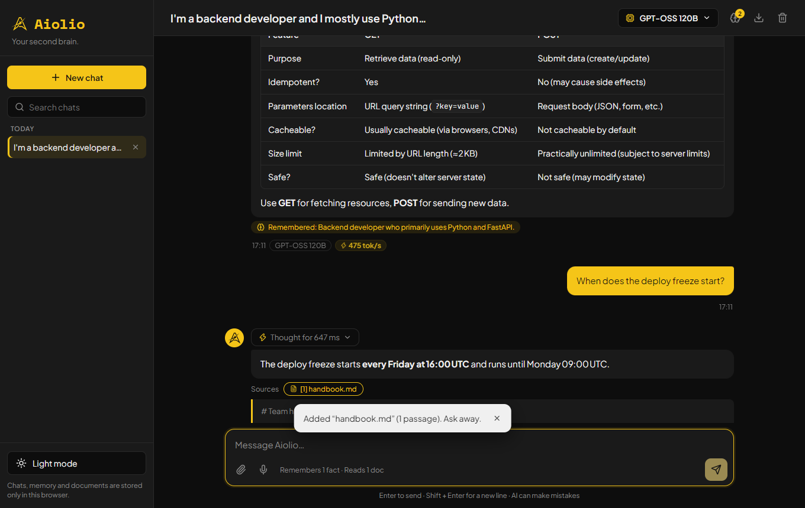
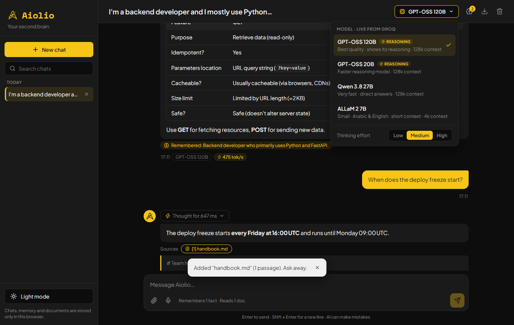
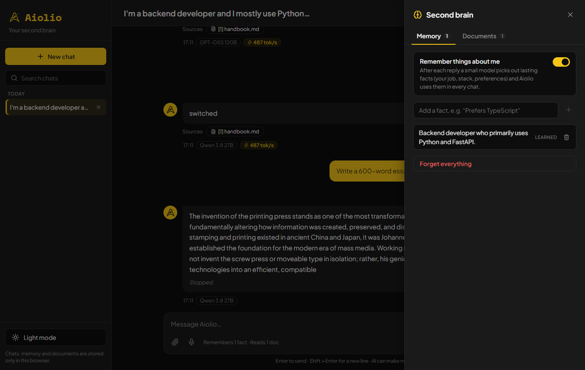
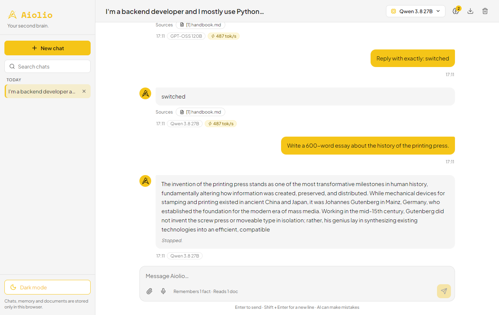
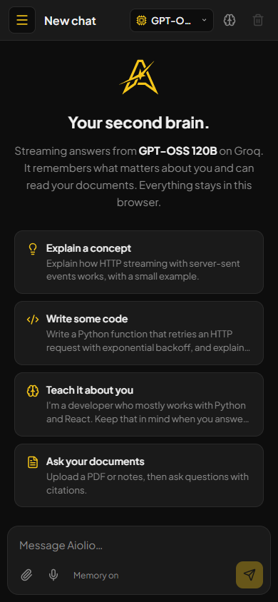
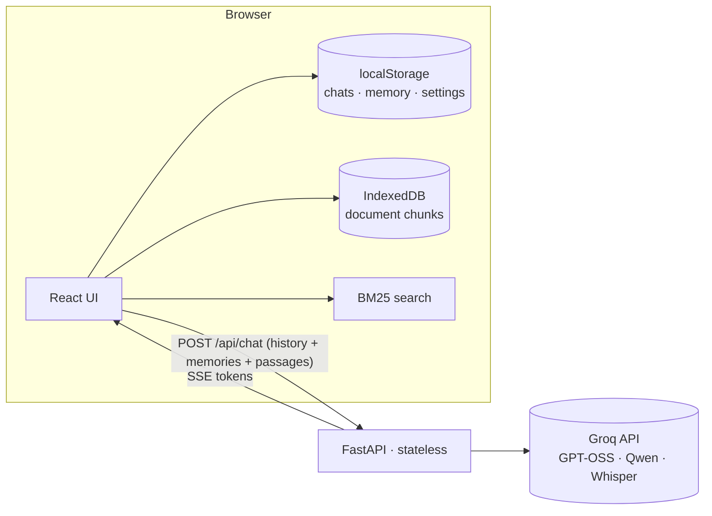

# Aiolio — your second brain

A streaming AI assistant that **remembers you** and **reads your documents**. React + TypeScript front end, stateless FastAPI back end, open models served by Groq at ~500 tokens/second.

**[Live demo →](https://aiolio-chatbot-app.vercel.app/)**



> The backend runs on Render's free tier, which sleeps when idle. The app detects this and shows a "waking up" banner; the first reply can take up to a minute, the rest are instant.

## Features

| | |
|---|---|
| **Real token streaming** | Server-sent events straight from Groq, with a stop button. Every reply shows its measured speed (tok/s), token count and time to first token. |
| **Model picker, live from Groq** | The list comes from Groq's `/models` API, so retired models vanish on their own. Reasoning models (GPT-OSS) stream their thinking into a collapsible panel, with a low/medium/high effort setting. |
| **Long-term memory** | After each reply, a small model pulls out lasting facts ("Works as a backend developer, uses FastAPI") and Aiolio uses them in every chat. You can view, add and delete them. |
| **Chat with your documents** | Drop in a PDF, Markdown, text or code file. Passages are found with BM25 search *in the browser*, sent with the question, and cited as [1], [2] with clickable excerpts. |
| **Voice input** | Dictate with the mic; Whisper on Groq transcribes it. |
| **Proper rendering** | GitHub-flavoured Markdown, tables, syntax highlighting, copyable code blocks. |
| **Chat tools** | Edit and resend your last message, regenerate, rename, search across chat titles *and* contents, export to Markdown, undo delete. |
| **Private by design** | Chats, memories and documents live only in your browser (localStorage + IndexedDB). The server stores nothing, so visitors never see each other's data. |
| **Resilient** | Friendly errors with retry, rate-limit handling, cold-start detection, automatic history trimming to fit each model's context window, crash screen instead of a blank page. |
| **Responsive and accessible** | Mobile layout, dark/light theme, keyboard navigation, reduced-motion support. |

<p>
  
  
</p>
<p>
  
  
</p>

## Architecture


```mermaid
flowchart LR
  subgraph Browser
    UI[React UI] --> LS[(localStorage<br/>chats · memory · settings)]
    UI --> IDB[(IndexedDB<br/>document chunks)]
    UI --> BM25[BM25 search]
  end
  UI -- "POST /api/chat (history + memories + passages)" --> API[FastAPI · stateless]
  API -- SSE tokens --> UI
  API --> Groq[(Groq API<br/>GPT-OSS · Qwen · Whisper)]
```

The backend is deliberately **stateless**: every request carries the history it needs. Render's free tier wipes its disk whenever it sleeps, so a server-side database would lose data without warning. Keeping state in the browser means nothing gets lost, no user accounts are needed, and each visitor's data stays separate.

The server's jobs are:

- keep the Groq key secret,
- enforce per-IP rate limits and input caps,
- trim history to the selected model's context window,
- assemble the system prompt (persona + memories + document passages),
- relay the stream.

## Tech stack

| Layer | Technology |
|---|---|
| Front end | React 19, TypeScript, Vite, react-markdown + remark-gfm + rehype-highlight, lucide icons |
| Back end | Python, FastAPI, Groq SDK (async), pypdf |
| Models | GPT-OSS 120B / 20B, Qwen, ALLaM, or whatever Groq serves; Whisper for speech |
| Testing | pytest (API with a fake Groq client), Vitest (SSE parser, retrieval, storage, export) |
| CI / hosting | GitHub Actions · Vercel (front end) · Render (back end) |

## Running locally

**Prerequisites:** Python 3.10+, Node.js 20+, a free [Groq API key](https://console.groq.com/keys).

```bash
git clone https://github.com/HassanAiolio/aiolio-chatbot-app.git
cd aiolio-chatbot-app
```

**Back end**

```bash
cd backend
python -m venv .venv
source .venv/bin/activate        # Windows: .venv\Scripts\activate
pip install -r requirements-dev.txt
echo "GROQ_API_KEY=your_key_here" > .env
uvicorn server:app --reload --port 8000
```

**Front end** (in a second terminal)

```bash
cd frontend
cp .env.example .env             # VITE_API_URL=http://localhost:8000
npm install
npm run dev                      # http://localhost:5173
```

**Tests**

```bash
cd backend && pytest -q
cd frontend && npm test && npm run typecheck
```

## API

| Method | Endpoint | Description |
|---|---|---|
| GET, HEAD | `/api/health` | Health check (HEAD for uptime pingers) |
| GET | `/api/models` | Chat models currently available on Groq, default first |
| POST | `/api/chat` | Streams a reply as SSE: `meta` → `reasoning`* → `token`* → `done` \| `error` |
| POST | `/api/memory/extract` | Suggests facts to remember or forget from one exchange |
| POST | `/api/documents` | Extracts and chunks a PDF or text file (nothing is stored) |
| POST | `/api/transcribe` | Speech to text with Whisper |

Errors always look like `{"error": {"code": "...", "message": "..."}}`, and the message is safe to show a user.

## Configuration

| Variable | Where | Default | Description |
|---|---|---|---|
| `GROQ_API_KEY` | backend | — | Required |
| `ALLOWED_ORIGINS` | backend | Vercel URL + localhost | Comma-separated CORS origins |
| `DEFAULT_MODEL` | backend | `openai/gpt-oss-120b` | Used when the client doesn't choose |
| `UTILITY_MODEL` | backend | `openai/gpt-oss-20b` | Memory extraction |
| `RATE_LIMIT_CHAT_PER_MINUTE` / `_PER_DAY` | backend | `10` / `200` | Per-IP limits |
| `VITE_API_URL` | frontend | `http://localhost:8000` | Backend URL (`REACT_APP_API_URL` is still accepted) |

To change Aiolio's personality, edit `PERSONA` in [backend/llm.py](backend/llm.py).

## License

MIT
